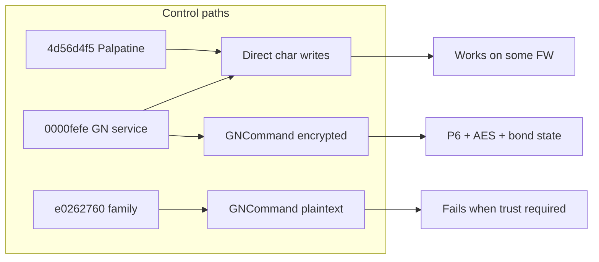

# Android app: incorporate ReSound GN / encryption knowledge

> **Copy note:** This document is the same plan as `android_resound_gn_sync` in the Cursor plans folder. Evidence paths under **`c:\Projects\hearing_aid_control`** refer to the sibling web/reverse-engineering repo.

## Sources and evidence (where this information came from)

All protocol claims below are traceable to these artifacts in **`c:\Projects\hearing_aid_control`** (web repo) unless noted.

| Source | Path / artifact | Use |
|--------|-----------------|-----|
| **ILSpy decompile spec** | [docs/resound_gn_encryption_1.3.0_ilspy.md](c:/Projects/hearing_aid_control/docs/resound_gn_encryption_1.3.0_ilspy.md) | AES counter stream, `P6TrustKeyHandler` SHA-256 + ECDH P-256, `GNConstants` UUIDs, command framing, `HI says hi` check, `WriteDataToCommandInterfaceNoEncryption` |
| **Decompiled C# (primary)** | `artifacts/decompiled/resound_smart3d_1.3.0_ble/` (regenerate with [tools/ilspy_ble_resound_smart3d.ps1](c:/Projects/hearing_aid_control/tools/ilspy_ble_resound_smart3d.ps1)) | Authoritative: `BLE/HI/AESDeEncoder.cs`, `P6TrustKeyHandler.cs`, `HandleBasedPlatform.cs`, `BLE/GNConstants.cs`, `PassthroughDeEncoder.cs` |
| **APK provenance** | `ReSound Smart 3D_1.3.0_APKPure.apk` (project root); extracted under `artifacts/extracted/resound_smart3d_1.3.0_apk/assemblies/BLE.dll` | Managed BLE logic embedded in Xamarin app |
| **Smart 3D 1.3.0 static GATT XML** | [docs/resound_smart3d_1.3.0_ble_static.md](c:/Projects/hearing_aid_control/docs/resound_smart3d_1.3.0_ble_static.md) | Embedded characteristic names, R/W/N, program/volume UUIDs, services FEFE / P5 / DFU / LEA |
| **Legacy Java client (direct writes)** | [docs/resound_legacy_ble_smart_3.3.1.md](c:/Projects/hearing_aid_control/docs/resound_legacy_ble_smart_3.3.1.md); JADX `jadx_output/resound_smart_3.3.1/sources/com/gn/bluetooth/d.java` + `a/d/g.java`, `l.java`, `f.java` | Confirmed 1-byte writes: mic `32c9322d`, stream `054e99c7`, melody `23e2faf2` |
| **Newer Smart 3D overview** | [docs/resound.md](c:/Projects/hearing_aid_control/docs/resound.md) | `e0262760` family appears on **newer** stacks; FEFE + command UUIDs still relevant |
| **UUID dossier / master** | [docs/uuid_resound_dossier_2026-03-28.md](c:/Projects/hearing_aid_control/docs/uuid_resound_dossier_2026-03-28.md), [docs/resound_uuid_reference_master_2026-03-28.md](c:/Projects/hearing_aid_control/docs/resound_uuid_reference_master_2026-03-28.md) | Cross-profile semantics, handle-tunnel vs direct |
| **Android app under change** | `C:\projects\hearing_aid_control_android` | [src/adapters/resoundAdapter.ts](C:/projects/hearing_aid_control_android/src/adapters/resoundAdapter.ts), [src/brand/detection.ts](C:/projects/hearing_aid_control_android/src/brand/detection.ts) |

**Method note:** Raw **ASCII UUID grep** of `BLE.dll` missed some compiled `Guid` constants; **ILSpy** on `BLE.dll` is authoritative for `GNConstants` (including `1959a468` / `8b51a2ca` in **1.3.0**, not only 1.43.1).

---

## Session synthesis — everything learned (condensed)

1. **Three client eras:** (a) **ReSound Smart 3.3.1** — pure Java `com.gn`, **no** `e0262760` / no `1959a468` in DEX, **direct FEFE** writes. (b) **Smart 3D 1.3.0** — Xamarin, **`BLE.dll`** has **both** embedded FEFE/Palpatine GATT XML **and** **`GNCommand`/`GNNotify`** on **FEFE** per `GNConstants`. (c) **Smart 3D 1.43.1+** — adds **`e0262760`** family alongside FEFE/command stack.
2. **Volume (HA gain):** Mic attenuation UUID **`32c9322d-…`**; stream **`054e99c7-…`**; UI/docs often **1–255** (0 = mute in many profiles). **ASHA** `00e4ca9e-…` is **streaming** volume (int8), different role.
3. **Program:** **`dc82f820-…`** (`GNCurrentActiveProgram`) — commonly **1 byte** index; command tunnel **`[0x03, 0x08, idx]`** when handle-controlled.
4. **Command service placement:** GN command/notify/security/version/challenge/public-key UUIDs from ILSpy belong under **`0000fefe-…`**, not **`e0262760-…`**. Android adapter defaulting unknown GN chars to **e026** is a **bug risk**.
5. **Encryption:** Optional **trusted bond**; session uses **BouncyCastle-style** custom **AES counter keystream** (`AESDeEncoder.CryptDecrypt`), keys derived via **`P6TrustKeyHandler`** (challenge + **hard-coded `AppBaseKeys`/`AppBaseKeys_2`** + ECDH + labeled SHA-256 strings `appsession`, `hisession `, `appSharedBaseKey`). **Plaintext** path: `WriteDataToCommandInterfaceNoEncryption` / discover **`[0x06]`** without session in some states.
6. **Auth strings:** App sends encrypted **`APP says hi `** (trailing space); device response must decrypt to **`HI says hi`** (`HandleBasedPlatform.EncryptionResponse`).
7. **Notify framing:** First byte **opcode** (1–8: bond ack, notification vector, read out, notification payload, blob, discover, discover end, error); remainder **decrypted** when trusted (`Notification` handler in `HandleBasedPlatform`).
8. **DFU mode:** Separate service **`213885c7-…`** and **DFU\*** UUIDs in `GNConstants`; different notify attachment during DFU trusted bond (ILSpy: challenge char receives notifications until swap).
9. **Personal / legal:** User scope is personal tooling; redistribution of keys/apps still sensitive — document **personal use** in repo docs.

---

## Current state (Android app)

- React Native + **react-native-ble-plx**; main logic in [`resoundAdapter.ts`](C:/projects/hearing_aid_control_android/src/adapters/resoundAdapter.ts).
- **Direct GATT** for mic attenuation, active program, security-cap write `[4,0,0,0,0]`; **plaintext** GN command frames; **no** AES encrypt/decrypt; **no** full challenge/ECDH bond.
- **ASHA** + MFi HAP + vendor battery paths as today.

---

## Gaps vs evidence (diagram)

---

## Phase A — Service resolution, brand, stream, documentation

| Item | Action |
|------|--------|
| **A1** | `findService`: prefer `charServiceMap`; else **FEFE → P5 → e026** for GN command/notify/security/version/challenge/public-key/passcode UUIDs (see `GNConstants.cs` in ILSpy output). |
| **A2** | `discover()` / `writeGnCommandFrame` use **same** resolved service as `setupGnNotify`. |
| **A3** | `detection.ts`: **resound** if **`0000fefe`** service + any of GN cmd/notify / `32c9322d` / `dc82f820` (tighten to avoid false positives). |
| **A4** | `054e99c7` stream attenuation path for `setStreamingVolume`. |
| **A5** | Android **README** + `resoundAdapter` header: **table of sources** (link or copy paths from **Sources and evidence** above). Optionally copy `resound_gn_encryption_1.3.0_ilspy.md` + `resound_legacy_ble_smart_3.3.1.md` into `hearing_aid_control_android/docs/`. |

---

## Phase B — Notify diagnostics (pre-crypto or alongside)

| Item | Action |
|------|--------|
| **B1** | Document opcodes **1–8** from `HandleBasedPlatform.Notification` switch; parse **0x08** error tuples when ciphertext absent. |
| **B2** | One-shot log hint if payload looks encrypted / undecipherable. |

---

## Phase C — Encryption modes implementation plan (explicit)

This is the **full** plan to match **`IBLE.HI` / `HandleBasedPlatform`** behavior, not only “optional crypto.”

### C0. Encoder mode enum (mirror .NET)

- **`PassthroughDeEncoder`**: `Encrypt`/`Decrypt` = identity (used before bond or when testing plaintext).
- **`AESDeEncoder`**: production session codec after `GenerateKeys(encoder)`.

**Switch rules (from ILSpy):** Replace passthrough with **`AESDeEncoder`** when starting **CreateTrustedBond\*** / **EstablishTrustedBond**; **`SetKeys(hiSession, appSession)`** after `P6TrustKeyHandler.GenerateKeys`.

### C1. `AESDeEncoder` port (`BLE/HI/AESDeEncoder.cs`)

- **`CryptDecrypt`**: `AesFastEngine` ECB, encrypt **counter** block-by-block, XOR plaintext; **`IncrementCounter`** (carry bounded — see source).
- **`SetKeys(decryptKey, encryptKey)`**: split each 32-byte blob into **16-byte AES key + 16-byte counter seed**; reset bytes **12–15** of counter to **`0,0,0,1`** when `resetCounters`.
- **Outgoing** = `encryptKey` half; **incoming** = `decryptKey` half.
- Embed **`AppBaseKeys`** / **`AppBaseKeys_2`** byte arrays; cite **ILSpy + APK version** in comment.

### C2. `P6TrustKeyHandler` port (`BLE/HI/P6TrustKeyHandler.cs`)

- **`UpdateChallenge`**: version **1** vs **else** determines **SHA256(challenge[0:20]||appBaseKey)** vs **SHA256(appBaseKey||challenge[0:20])** → `hikey`; then **`commonSecret` = SHA256(hikey || challenge[20:36])**.
- **`SetHIPublicKey`**: generate **ephemeral** EC key pair **secp256r1**, ECDH with HI public bytes, **`commonSecret` = SHA256(commonSecret || dhkey)**.
- **`SetPasscode`**: mix **SHA256(hiid || utf8(pass))** into `commonSecret`.
- **`GenerateKeys`**: derive **`appSession`**, **`hiSession`**, **`sharedAppKey`** with fixed UTF-8 labels; call **`encoder.SetKeys(hiSession, appSession)`**.
- **`GenerateAuth`**: **`Encrypt("APP says hi ")`**, prepend **`[0,0,4,0,appConnectType,sharedAppIndex]`**, append **app ephemeral public key bytes** (`publicDHKey[1..]`).

**RN crypto:** Prefer **`react-native-quick-crypto`** or equivalent for **P-256 ECDH + SHA-256** if `crypto.subtle` is insufficient on your RN/Hermes target.

### C3. Bond **variants** (all in `HandleBasedPlatform.cs`)

| Mode | Method | Notes |
|------|--------|-------|
| **Boot** | `CreateTrustedBondUsingBoot` | Two-stage auth (`GenerateAuth` types **1** then **2**); may throw **HIWaitsForReboot**; wait reconnect; persist **`SharedAppSecret`** / index from responses. |
| **Passcode** | `CreateTrustedBondUsingPasscode` | **`GenerateAuth` type 3**; `SetPasscode(GetHIID(challenge), passcode)` before keys. |
| **DFU** | `CreateTrustedBondForDFU` | **`GenerateAuth` type 5**; uses **DFU** service + char UUIDs from `GNConstants`; notify routing swaps after success. |
| **Reconnect** | `EstablishTrustedBond` | **`GenerateAuth` type 4** with stored **`SharedAppIndex`** / **`SetSharedAppKey`**. |

### C4. GATT sequence (non-DFU) — `RespondeWithAuth`

- Write auth bytes to **`add69bfc-…`** (`GNTrustedAppChallenge`).
- Await notification on **`8b51a2ca-…`** (`GNNotify`) (DFU: different wiring).
- Decrypt response payload; verify UTF-8 contains **`HI says hi`**.

### C5. Post-bond traffic

- **`writeGnCommandFrame`**: **`encoder.Encrypt(fullFrame)`** when trusted (same as `SetData` path opcode **3**).
- **`Notification`**: drop first byte (opcode) for non-DFU; **`encoder.Decrypt`** remainder; dispatch opcodes **2,3,4,5,6,7,8** as in C#.
- **`WriteNotificationVector`**: encrypt **17-byte** vector (`0x01` + 16-byte bitfield) — needed for subscriptions on handle-controlled characteristics.
- **`WriteDataToCommandInterfaceNoEncryption`**: raw write to **`1959a468-…`** when encryption must be bypassed (document when safe per firmware).

### C6. Persistence

- Store **`SharedAppSecret`** (and **`SharedAppIndex`** if returned) securely for **EstablishTrustedBond** on reconnect.

### C7. Testing

- Compare byte traces against **official app** or **nRF Sniffer** once per bond mode; unit-test **AESDeEncoder** against vectors generated from a small **C# or TS reference** harness.

---

## Files to touch

- **A, B:** [`resoundAdapter.ts`](C:/projects/hearing_aid_control_android/src/adapters/resoundAdapter.ts), [`detection.ts`](C:/projects/hearing_aid_control_android/src/brand/detection.ts), optional [`ControlPanel.tsx`](C:/projects/hearing_aid_control_android/src/screens/ControlPanel.tsx).
- **A5 / docs:** [`README.md`](C:/projects/hearing_aid_control_android/README.md), optional `hearing_aid_control_android/docs/*.md` (copies from web repo).
- **C:** `src/ble/gn/` (new): `aesDeEncoder.ts`, `p6TrustKeyHandler.ts`, `gnBondState.ts`, `gnConstants.ts` (mirror UUIDs), adapter integration; **`package.json`** crypto dependency if needed.

---

## Verification

- Physical ReSound: confirm **FEFE** parent for `1959a468` / `32c9322d` in logs after A1.
- After **C**: command/notify payloads match **encrypted** shape; **HI says hi** path succeeds for your bond method.
- Regression: Starkey/Rexton unaffected; FEFE detection narrowly scoped.
